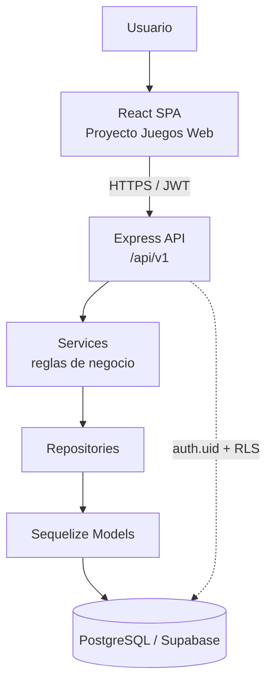
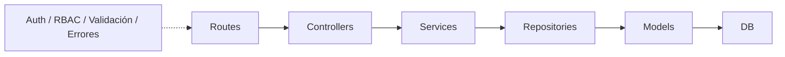
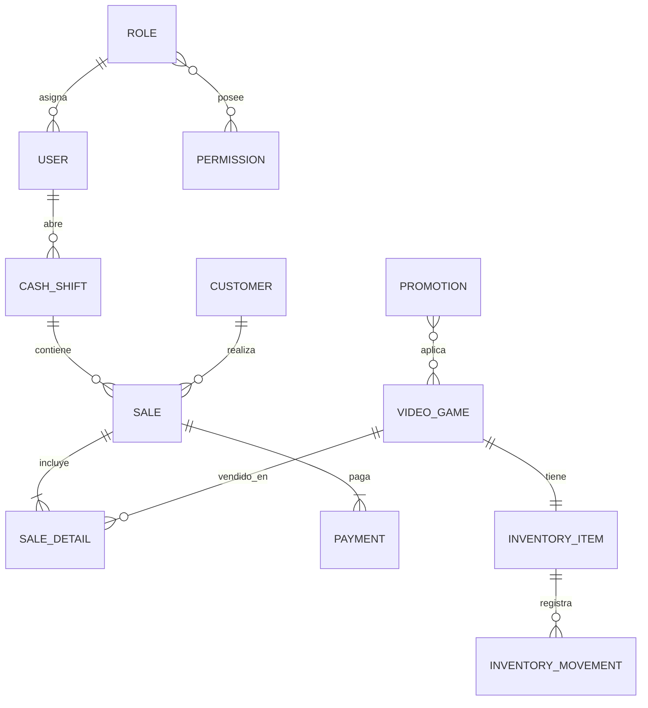
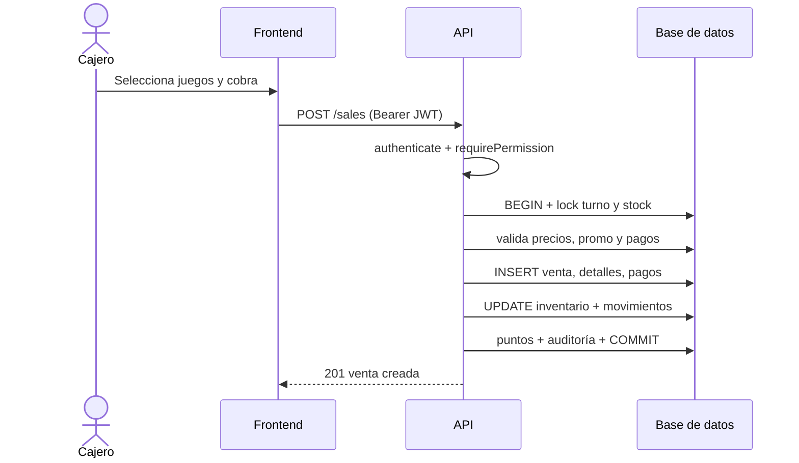

# Arquitectura y diagramas

## Vista general

```mermaid
flowchart TB
  U[Usuario] --> W[React SPA<br/>Proyecto Juegos Web]
  W -->|HTTPS / JWT| A[Express API<br/>/api/v1]
  A --> S[Services<br/>reglas de negocio]
  S --> R[Repositories]
  R --> M[Sequelize Models]
  M --> DB[(PostgreSQL / Supabase)]
  A -.->|auth.uid + RLS| DB
```

## Capas del backend

```mermaid
flowchart LR
  Routes --> Controllers --> Services --> Repositories --> Models --> DB
  Middlewares[Auth / RBAC / Validación / Errores] -.-> Routes
```

## Modelo de datos simplificado

```mermaid
erDiagram
  USER ||--o{ CASH_SHIFT : abre
  CASH_SHIFT ||--o{ SALE : contiene
  CUSTOMER ||--o{ SALE : realiza
  SALE ||--|{ SALE_DETAIL : incluye
  SALE ||--|{ PAYMENT : paga
  VIDEO_GAME ||--o{ SALE_DETAIL : vendido_en
  VIDEO_GAME ||--|| INVENTORY_ITEM : tiene
  INVENTORY_ITEM ||--o{ INVENTORY_MOVEMENT : registra
  PROMOTION }o--o{ VIDEO_GAME : aplica
  ROLE ||--o{ USER : asigna
  ROLE }o--o{ PERMISSION : posee
```

## Flujo de venta

```mermaid
sequenceDiagram
  actor C as Cajero
  participant FE as Frontend
  participant API as API
  participant DB as Base de datos

  C->>FE: Selecciona juegos y cobra
  FE->>API: POST /sales (Bearer JWT)
  API->>API: authenticate + requirePermission
  API->>DB: BEGIN + lock turno y stock
  API->>DB: valida precios, promo y pagos
  API->>DB: INSERT venta, detalles, pagos
  API->>DB: UPDATE inventario + movimientos
  API->>DB: puntos + auditoría + COMMIT
  API-->>FE: 201 venta creada
```
